<div align="center">

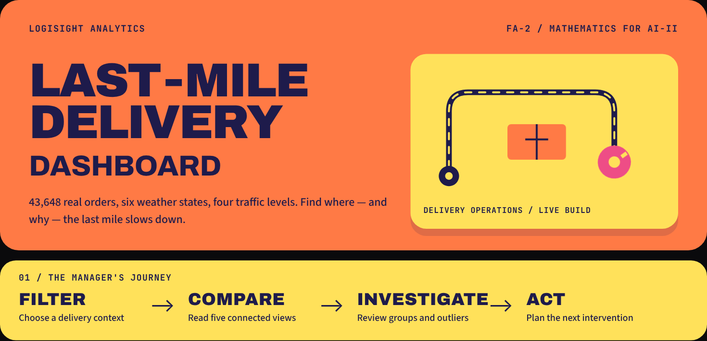

# Last-Mile Delivery Dashboard

**LogiSight Analytics · FA-2 · Mathematics for AI-II**

*Where does the last mile slow down, and why?*

[](https://lastmile-logisight.streamlit.app/)
[](#-run-it-locally)
[](#-the-3d-views)

[Live app](https://lastmile-logisight.streamlit.app/) ·
[How it works](#-how-the-app-works) ·
[Charts](#-the-five-compulsory-views) ·
[3D views](#-the-3d-views) ·
[Data cleaning](#-stage-4--data-cleaning--preparation) ·
[Rubric map](#-mapping-to-the-fa-2-rubric)

</div>

---

## 📑 Table of contents

1. [Project overview](#-project-overview)
2. [The LogiSight scenario](#-the-logisight-scenario)
3. [A tour of the dashboard](#-a-tour-of-the-dashboard)
4. [How the app works](#-how-the-app-works)
5. [The dataset](#-the-dataset)
6. [Stage 4: data cleaning and preparation](#-stage-4--data-cleaning--preparation)
7. [Stage 5: the five compulsory views](#-the-five-compulsory-views)
8. [Optional views](#-optional-views)
9. [The 3D views](#-the-3d-views)
10. [The Act panel and the pipeline panel](#-the-act-panel-and-the-pipeline-panel)
11. [Key findings](#-key-findings)
12. [Design system](#-design-system)
13. [Project structure](#-project-structure)
14. [Run it locally](#-run-it-locally)
15. [Deploying on Streamlit Cloud](#-deploying-on-streamlit-cloud)
16. [Mapping to the FA-2 rubric](#-mapping-to-the-fa-2-rubric)
17. [Limitations and next steps](#-limitations-and-next-steps)

---

## 🚚 Project overview

This is an interactive **Streamlit** dashboard that turns 43,739 real last-mile delivery orders into answers a logistics manager can act on. It is the FA-2 build of the design blueprint created in FA-1. The infographic's layout, colour palette and manager's journey (**FILTER → COMPARE → INVESTIGATE → ACT**) are carried straight into the live app.

| | |
|---|---|
| **Live app** | https://lastmile-logisight.streamlit.app/ |
| **Repository** | https://github.com/DHWANAN722/last-mile-delivery-dashboard |
| **Stack** | Python · pandas · NumPy · Plotly (2D + 3D) · pydeck (3D map) · Streamlit |
| **Data** | `amazon_delivery.csv`: 43,739 orders, Feb–Apr 2022, `Delivery_Time` in minutes |
| **Charts** | 5 compulsory + 3 optional + 3 interactive 3D views + 4 alternate chart tabs |

<p align="center">
  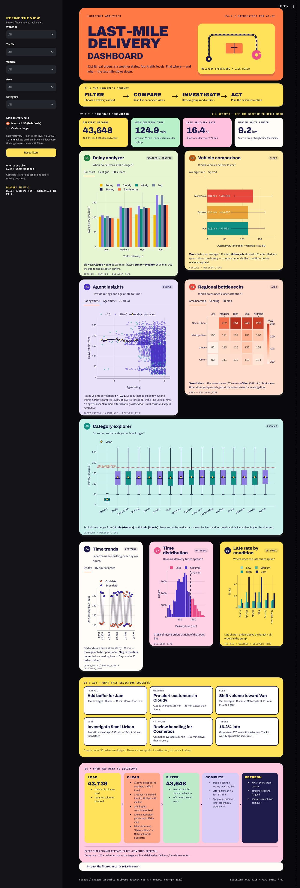
  <br><sub><i>The whole dashboard in one scroll: hero, journey strip, KPIs, five storyboard cards, optional charts, the Act panel and the data pipeline.</i></sub>
</p>

---

## 🏢 The LogiSight scenario

As an analyst at **LogiSight Analytics Pvt. Ltd.**, the job is to help logistics managers see **where and why deliveries run late** and which operational levers could improve performance. Managers need to:

- filter by **weather, traffic, vehicle type, product category and area**,
- see every chart and headline metric update **instantly**,
- compare like-for-like conditions before reallocating fleet, staff or buffers, and
- reach the dashboard **from anywhere**, which is why it is deployed on Streamlit Cloud.

---

## 🧭 A tour of the dashboard

The page reads top to bottom in the same order as the FA-1 storyboard.

<table>
<tr>
<td width="32%" valign="top">
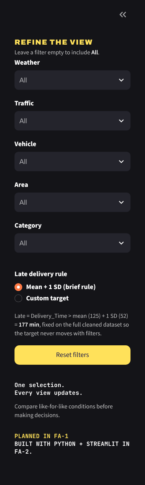
</td>
<td width="68%" valign="top">

### 1 · Refine the view (sidebar)

- **Five multiselect filters:** Weather, Traffic, Vehicle, Area, Category. Leave one empty to include *All*.
- **Late delivery rule:** keep the brief's rule (*mean + 1 SD*) or switch to a **custom target** in minutes.
- **Reset filters:** one click clears everything back to the full dataset.
- The note under the rule shows how the threshold is worked out, so the definition of "late" is never hidden.

</td>
</tr>
</table>

### 2 · Hero and the manager's journey

The orange banner introduces the dataset. Its route illustration is animated (moving dashes, a spinning wheel and a bobbing parcel). The yellow strip below restates the four-step journey from the infographic.

### 3 · KPI tiles

<p align="center">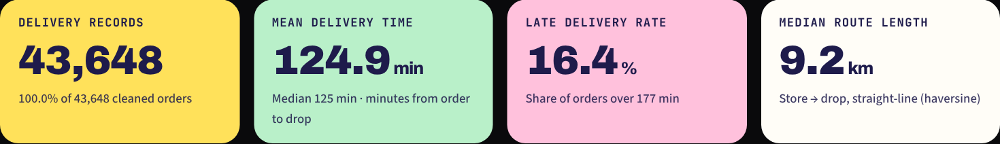</p>

| Tile | What it shows | How it's computed |
|---|---|---|
| **Delivery records** | Rows in the current selection | `len(filtered)` and its share of all cleaned rows |
| **Mean delivery time** | Average minutes from order to drop | `filtered.Delivery_Time.mean()`, plus the median |
| **Late delivery rate** | % of orders above the late target | `100 × (Delivery_Time > target).mean()` |
| **Median route length** | Typical store-to-drop distance | Median haversine distance in km |

When a filter is active, the tiles also show a **delta against the full dataset** (e.g. `+49.2 min vs all`), so you can see at a glance how much worse or better a scenario is.

### 4 · The storyboard cards

Five numbered pastel cards (**01–05**) hold the compulsory charts. Each card has a **question** at the top, **tabs** for alternate views (including 3D), a **one-line takeaway** generated from the current data, and a **source line** naming the columns used. That matches the FA-1 card anatomy exactly.

### 5 · Optional charts, Act panel, pipeline panel, data table

Three optional cards (06–08), then an auto-generated **Act** panel, a **From raw data to decisions** panel with the real cleaning numbers, and an expandable **record table** with a **CSV download** of the filtered rows.

---

## ⚙️ How the app works

### The FILTER → COMPUTE → REFRESH loop

Streamlit re-runs `app.py` from top to bottom every time a widget changes. The app uses that to give every chart one source of truth:

```
┌──────────┐   ┌──────────┐   ┌────────────┐   ┌──────────────┐   ┌──────────────┐
│   LOAD   │ → │  CLEAN   │ → │   FILTER   │ → │   COMPUTE    │ → │   REFRESH    │
│ read CSV │   │ cached   │   │ sidebar    │   │ group, mean, │   │ KPIs, charts,│
│ once     │   │ once     │   │ masks      │   │ late flag    │   │ Act panel    │
└──────────┘   └──────────┘   └────────────┘   └──────────────┘   └──────────────┘
                                   ▲                                      │
                                   └──────── every filter change ─────────┘
```

1. **Load + clean (cached).** `load_and_clean()` is wrapped in `@st.cache_data`, so the 5.9 MB CSV is read and cleaned **once per server**, not on every click. It returns the cleaned DataFrame and a `log` dictionary of what was fixed.
2. **Filter.** `sidebar()` collects the five multiselects into a dict. `apply_filters()` builds one boolean mask:
   ```python
   mask = pd.Series(True, index=df.index)
   for col, chosen in selections.items():
       if chosen:                       # empty = "All"
           mask &= df[col].astype(str).isin(chosen)
   f = df[mask]
   ```
3. **Compute.** Every chart function takes the **same filtered frame `f`**, so all views always describe the same records. Grouping happens inside each view (`groupby(...).agg(mean, median, size)`).
4. **Refresh.** KPIs, the takeaways under each chart, and the Act panel all come from `f`, so they update together. If a selection matches nothing, the app shows a friendly *"No deliveries match"* card instead of empty or broken charts.

### How "late" is defined

The brief defines a late delivery as one whose time **exceeds the mean plus one standard deviation**.

```
mean (124.9 min) + 1 SD (51.9 min) = 176.8 ≈ 177 min  →  Late if Delivery_Time > 177
```

- The threshold is computed **once on the full cleaned dataset**, not on the filtered subset. Otherwise the target would move every time a filter changed and late rates couldn't be compared across scenarios.
- Switch the sidebar radio to **Custom target** and a slider (30–240 min) replaces the threshold. Every KPI, the histogram split, the category target line and the % late chart then follow the new target.

### What a filter change looks like

<p align="center">
  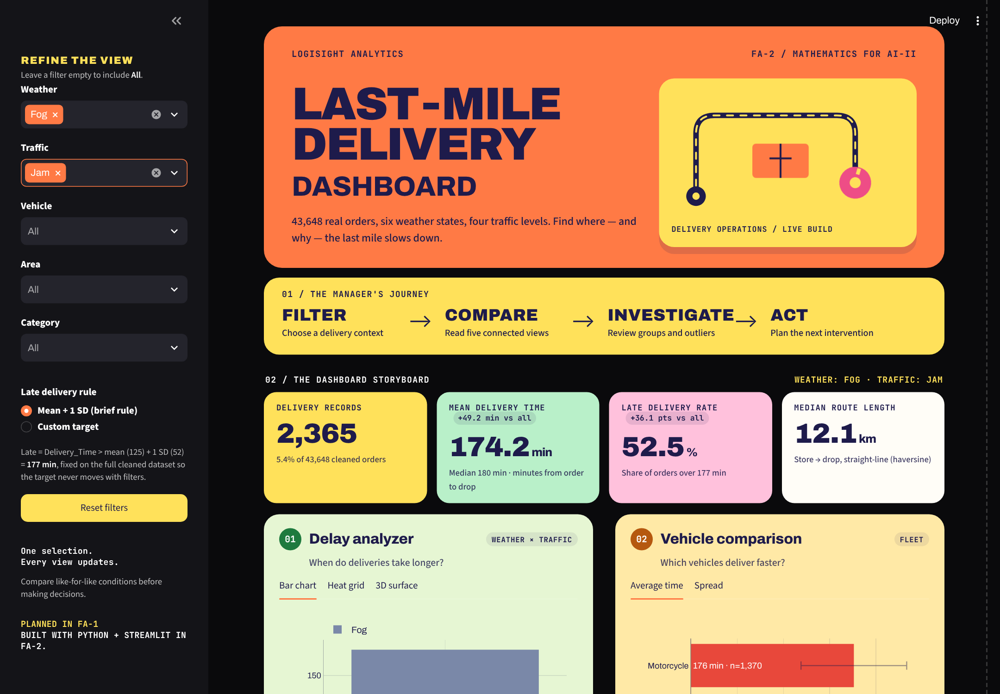
  <br><sub><i>Filtering to <b>Weather = Fog</b> and <b>Traffic = Jam</b>: 2,365 orders, mean time jumps to 174.2 min (+49.2 vs all), and the late rate climbs to 52.5% (+36.1 pts). The yellow tag at the top right lists the active filters.</i></sub>
</p>

---

## 🗂 The dataset

`amazon_delivery.csv` has **43,739 rows × 16 columns** of last-mile orders across Indian cities, February–April 2022.

| Column | Type | Description | Used in |
|---|---|---|---|
| `Order_ID` | text | Unique order identifier | duplicate check, table |
| `Agent_Age` | int | Delivery agent age in years | Agent insights, age groups |
| `Agent_Rating` | float | Agent rating (1–5 scale) | Agent insights, 3D cloud |
| `Store_Latitude` / `Store_Longitude` | float | Store coordinates | distance |
| `Drop_Latitude` / `Drop_Longitude` | float | Customer drop coordinates | distance, 3D map |
| `Order_Date` | date | Date the order was placed | Time trends |
| `Order_Time` | time | Time the order was placed | order hour, pickup wait |
| `Pickup_Time` | time | Time the agent picked up | pickup wait |
| `Weather` | category | Sunny, Cloudy, Windy, Fog, Stormy, Sandstorms | filter, Delay analyzer |
| `Traffic` | category | Low, Medium, High, Jam | filter, Delay analyzer, heatmap |
| `Vehicle` | category | Motorcycle, Scooter, Van (+ Bicycle) | filter, Vehicle comparison |
| `Area` | category | Urban, Metropolitan, Semi-Urban, Other | filter, Regional bottlenecks |
| `Delivery_Time` | int (min) | Minutes from order to delivery, **the target metric** | every view |
| `Category` | category | 16 product categories | filter, Category explorer |

---

## 🧹 Stage 4: data cleaning and preparation

All cleaning lives in one documented function, `load_and_clean()`. These are the actual numbers it produces:

| # | Step | Why | Result |
|---|---|---|---|
| 1 | **Trim text labels** and turn literal `"NaN "` strings into real missing values | Raw labels had trailing spaces (`"Jam "`, `"motorcycle "`) and text "NaN" that would form fake groups | Clean, mergeable groups |
| 2 | **Fix spelling and casing**: `Metropolitian` → `Metropolitan`, `motorcycle` → `Motorcycle` | Readable labels on every chart | 4 areas, title-case vehicles |
| 3 | **Duplicate check** on `Order_ID` | One order should be counted once | **0** duplicates |
| 4 | **Drop rows missing core dimensions** (Weather / Traffic) | These rows also lacked order time, so they can't be placed in any filter or view | **91 rows dropped** (0.2%) |
| 5 | **Validate ratings**: anything above 5 is invalid | Ratings live on a 1–5 scale | Invalid values set to missing |
| 6 | **Impute missing ratings** with the median | Keeps the rows for every other chart without biasing the mean | **54 ratings filled** |
| 7 | **Fix flipped coordinates** (negative store lat/long) | Some stores were recorded with the wrong sign | **156 coordinates corrected** |
| 8 | **Flag placeholder coordinates** (≈ 0, 0) | Would produce fake 0 km or 8,000 km routes | **3,495 rows** kept for charts, excluded from map and distance |
| 9 | **Parse dates and times** | Enable trends and time-based features | `Order_Date` as datetime, `Order_Hour` |

**Derived fields** (the "new calculated metrics" the brief asks for):

| Field | Formula |
|---|---|
| `Late` threshold | `mean(Delivery_Time) + std(Delivery_Time)` = **177 min** |
| `Age_Group` | `<25`, `25–40`, `40+` via `pd.cut` |
| `Distance_km` | Haversine distance between store and drop |
| `Order_Hour` | Hour from `Order_Time` |
| `Pickup_Wait_Min` | `Pickup_Time − Order_Time` (wraps past midnight) |
| `Weekday` | Day name from `Order_Date` |

**Result:** 43,739 rows loaded → **43,648 clean rows** ready for analysis.

---

## 📊 The five compulsory views

### 01 · Delay analyzer: *When do deliveries take longer?*

<table>
<tr>
<td width="50%">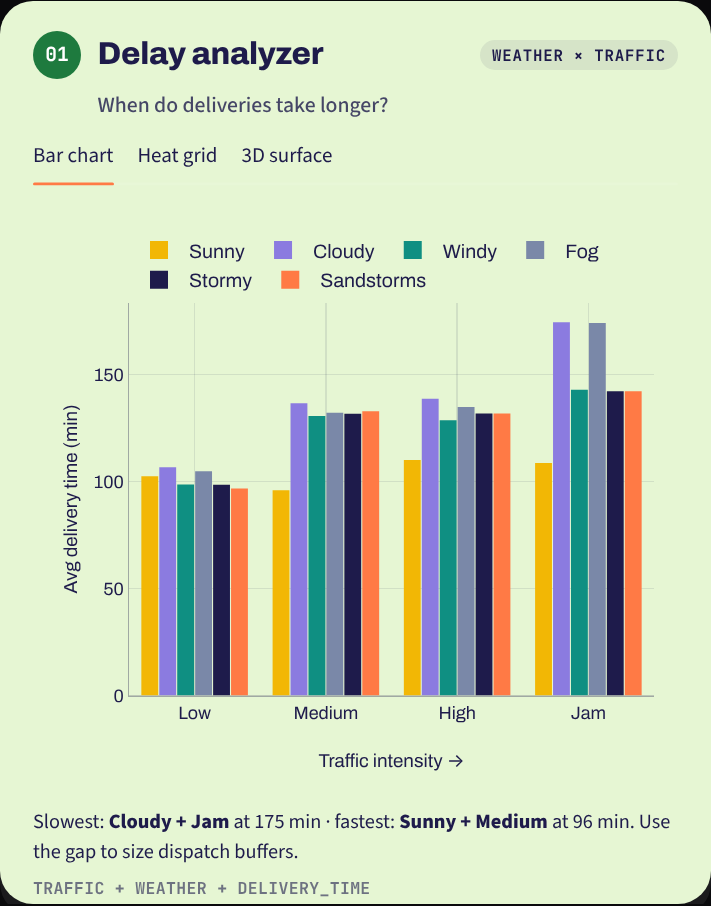</td>
<td width="50%">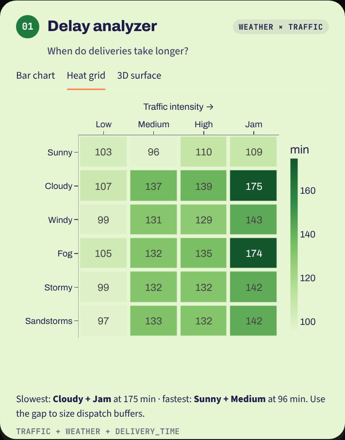</td>
</tr>
<tr>
<td align="center"><sub><b>Bar chart</b> (required): average time by traffic level, one bar per weather state</sub></td>
<td align="center"><sub><b>Heat grid</b>: the same numbers as a weather × traffic matrix</sub></td>
</tr>
</table>

- **Columns:** `Traffic`, `Weather`, `Delivery_Time`
- **Computation:** `groupby(["Weather", "Traffic"]).Delivery_Time.agg(["mean", "size"])`
- **Reading it:** time rises steadily from Low to Jam traffic, and Cloudy and Fog make jams worst. Hover any bar to see the exact mean and how many orders are behind it.
- **Business use:** size dispatch buffers for the worst combinations.

### 02 · Vehicle comparison: *Which vehicles deliver faster?*

<table>
<tr>
<td width="50%">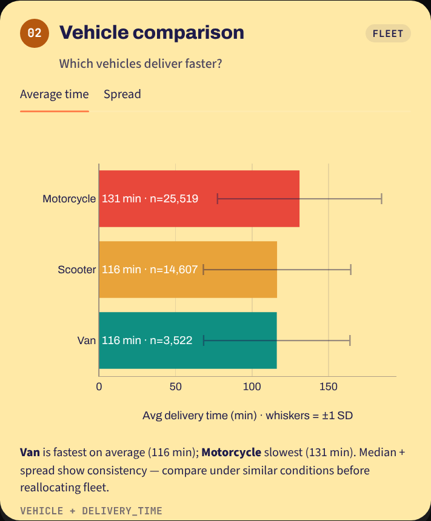</td>
<td width="50%">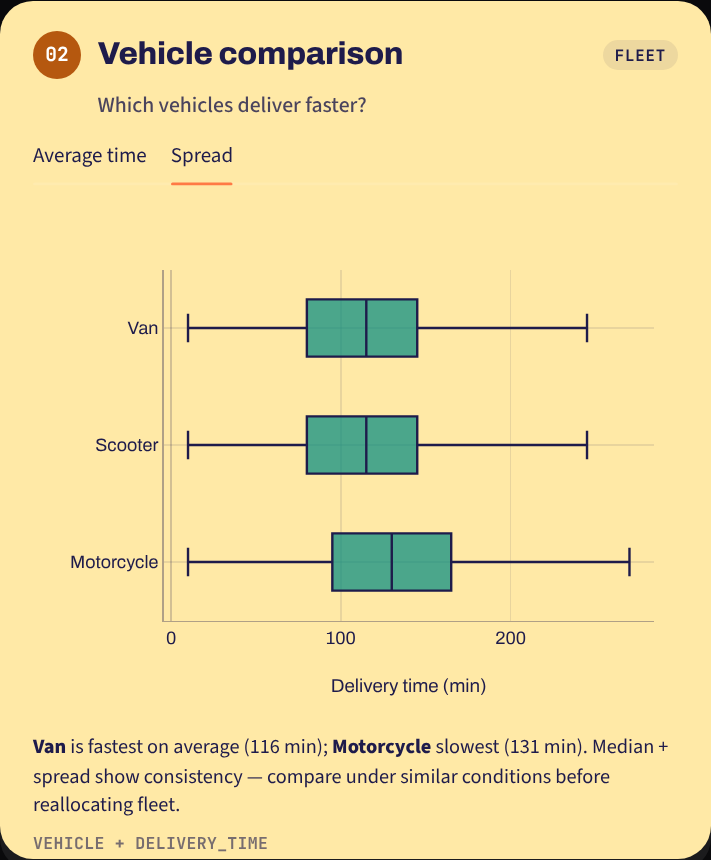</td>
</tr>
<tr>
<td align="center"><sub><b>Average time</b> (required): horizontal bars with ±1 SD whiskers and order counts</sub></td>
<td align="center"><sub><b>Spread</b>: box plots showing consistency</sub></td>
</tr>
</table>

- **Columns:** `Vehicle`, `Delivery_Time`
- **Reading it:** Scooters and Vans average **116 min**, Motorcycles **131 min**. The fastest bar is teal and the slowest red.
- **Business use:** compare fleets under similar conditions before shifting volume.

### 03 · Agent insights: *How do ratings and age relate to time?*

<p align="center">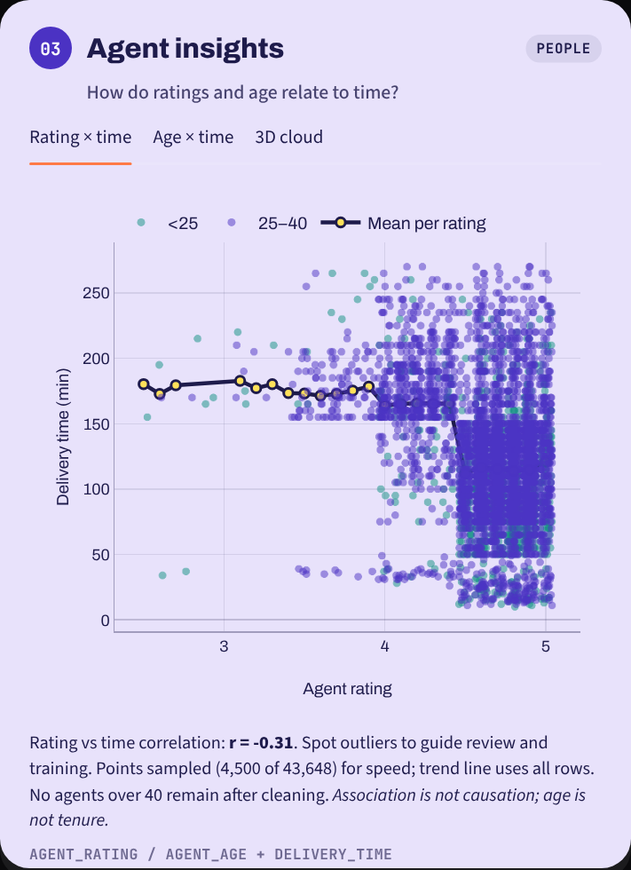</p>

- **Columns:** `Agent_Rating` (x), `Delivery_Time` (y), coloured by `Age_Group` (`<25`, `25–40`, `40+`)
- **Extras:** a navy **mean-per-rating trend line** uses all rows, while the dots are a 4,500-point sample so the page stays fast. The footer reports the **correlation (r = −0.31)**.
- **Tabs:** *Rating × time*, *Age × time* (bubble size = order count), *3D cloud*.
- **Caveat on the card:** *association is not causation; age is not tenure.* No agents over 40 remain after cleaning, and the card says so.

### 04 · Regional bottlenecks: *Which areas need closer attention?*

<p align="center">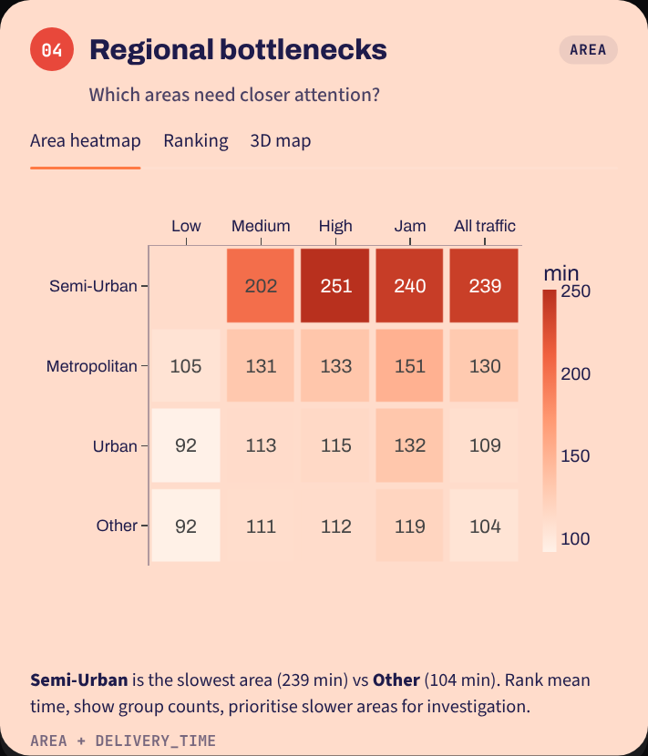</p>

- **Columns:** `Area`, `Traffic`, `Delivery_Time`
- **Heatmap** (required): rows are areas sorted slowest-first, columns are traffic levels plus an **All traffic** column. Cells show mean minutes, and hovering shows the count.
- **Tabs:** *Area heatmap*, *Ranking* (bars with counts), *3D map*.
- **Reading it:** **Semi-Urban** is by far the slowest (≈ 239 min overall, 251 min in High traffic).

### 05 · Category explorer: *Do some product categories take longer?*

<p align="center">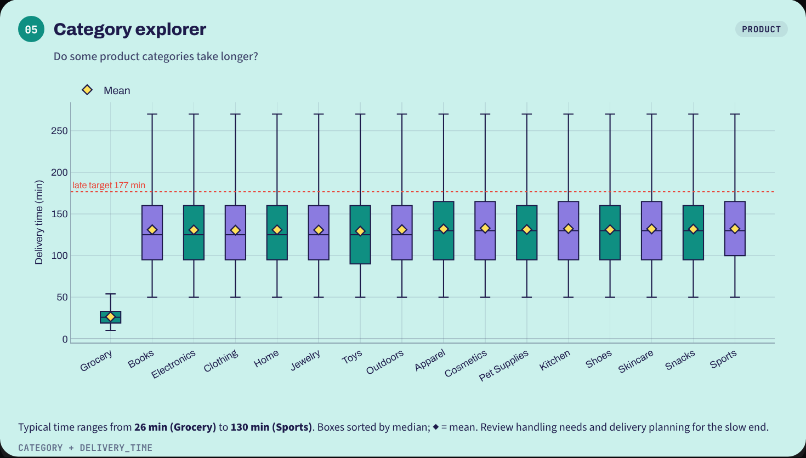</p>

- **Columns:** `Category`, `Delivery_Time`
- **Box plot** (required) of all 16 categories, **sorted by median**, with yellow ◆ marking the mean and a red dotted line at the **late target**.
- **Reading it:** Grocery is a clear outlier (median **26 min**). Every other category clusters around 125–130 min.

---

## ➕ Optional views

<p align="center">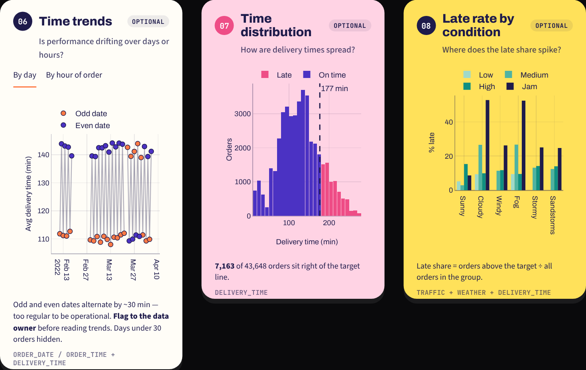</p>

| Card | Chart | Why it's there |
|---|---|---|
| **06 · Time trends** | Daily mean (odd and even dates coloured separately) + hourly bars | Shows drift over time, and exposes a data quirk (see below) |
| **07 · Time distribution** | Histogram split into *on time* and *late* at the target line | Shows the shape of delivery times and how many sit past the target |
| **08 · Late rate by condition** | % late per weather × traffic | Turns the brief's late definition into a direct comparison |

---

## 🧊 The 3D views

All three are fully interactive in the browser: drag to rotate, scroll to zoom, hover for values.

<table>
<tr>
<td width="33%" valign="top">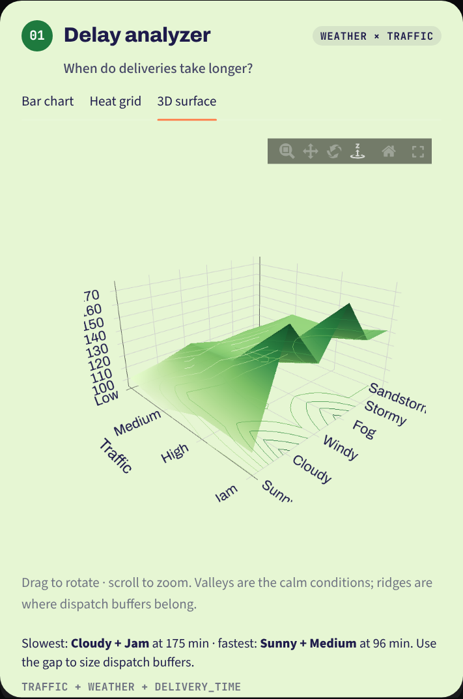</td>
<td width="33%" valign="top">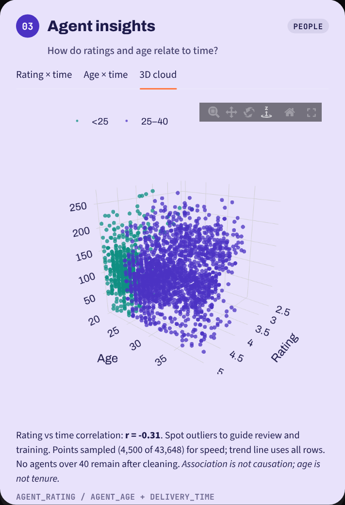</td>
<td width="33%" valign="top">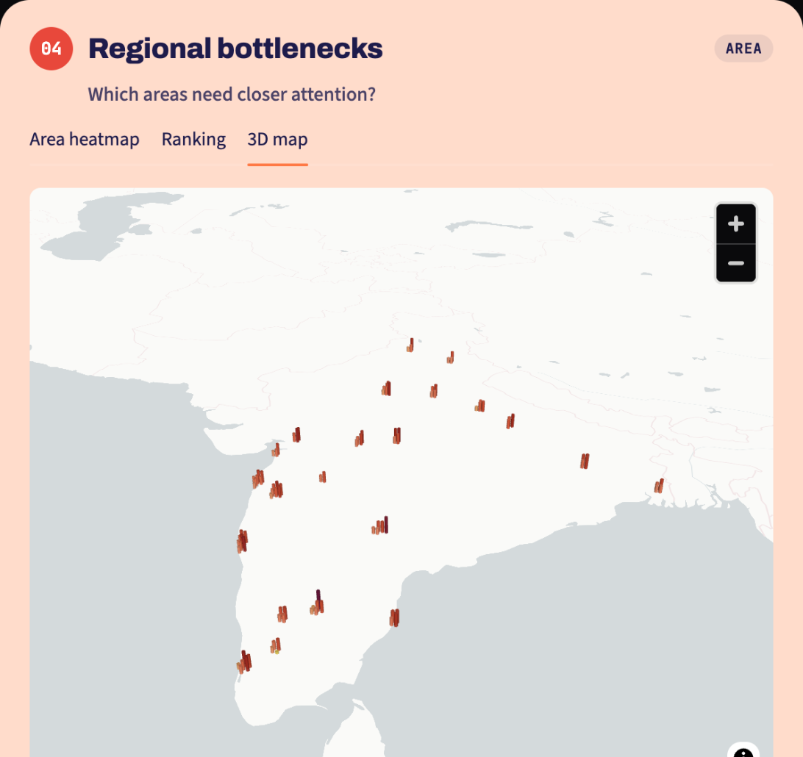</td>
</tr>
<tr>
<td align="center" valign="top"><sub><b>Weather × traffic surface</b> (Plotly <code>go.Surface</code>). Ridges are the slow combinations, valleys the calm ones. Contours are projected onto the floor.</sub></td>
<td align="center" valign="top"><sub><b>Agent point cloud</b> (Plotly <code>scatter_3d</code>): rating × age × delivery time, coloured by age group.</sub></td>
<td align="center" valign="top"><sub><b>3D column map</b> (pydeck <code>ColumnLayer</code>). Drops are grouped into ≈15 km cells, and column height and colour show mean delivery time.</sub></td>
</tr>
</table>

> **Why pre-aggregate the map?** Each column is an exact pandas group mean (cells with fewer than 5 orders are hidden). That makes the map's numbers match the rest of the dashboard and keeps the page light.

---

## 🎯 The Act panel and the pipeline panel

<p align="center">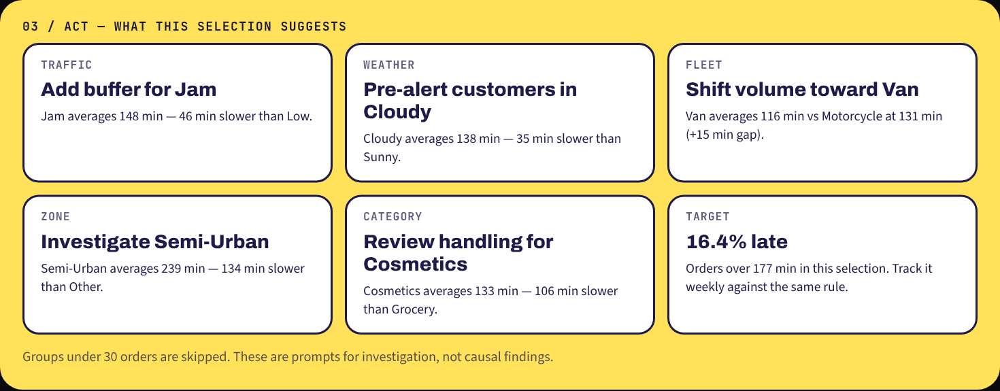</p>

The **Act** panel closes the manager's journey. For the current selection it finds the slowest and fastest group in Traffic, Weather, Vehicle, Area and Category (ignoring groups with fewer than 30 orders). It then writes a short prompt for each, such as *"Add buffer for Jam: Jam averages 148 min, 46 min slower than Low"*. It recalculates on every filter change.

<p align="center">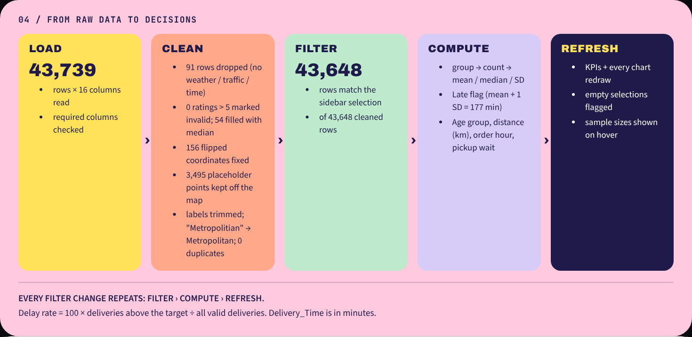</p>

The **From raw data to decisions** panel turns the infographic's pipeline diagram into a live readout: rows loaded, every cleaning fix with its count, rows matching the current filters, what is computed, and what refreshes.

---

## 💡 Key findings

| Finding | Evidence |
|---|---|
| Traffic is the biggest single driver of delay | Jam averages ~148 min vs ~102 min in Low traffic |
| Weather makes jams much worse | Cloudy + Jam = **175 min**, Sunny + Medium = **96 min** |
| Semi-Urban is the main regional bottleneck | ≈ **239 min** average vs 104–130 min elsewhere |
| Two-wheelers aren't automatically faster | Motorcycle **131 min** vs Scooter / Van **116 min** |
| Grocery is handled very differently | Median **26 min** vs ~125 min for every other category |
| Higher-rated agents tend to be faster | r = **−0.31** between rating and time |
| About 1 in 6 orders is late | **16.4%** above the 177-min target (7,163 orders) |
| Fog + Jam is the worst scenario | **52.5%** of those orders are late |
| ⚠️ Data quality flag | Odd dates average ≈110 min and even dates ≈142 min, too regular to be operational. Check with the data owner before reading trends. |

---

## 🎨 Design system

The look comes straight from the FA-1 infographic so the storyboard and the build match:

| Token | Hex | Used for |
|---|---|---|
| Orange | `#FF7A45` | hero, primary accent, active filter tags |
| Yellow | `#FFE15A` | journey strip, Act panel, sidebar headings |
| Navy | `#1E1B4B` | all text on cards, dark marks |
| Indigo | `#4B32C3` | chart accent, "on time" bars |
| Magenta | `#EE4D86` | "late" bars, 40+ agents |
| Teal | `#0F8F82` | fastest group, boxes |
| Background | `#0A0A0C` | near-black page, so the pastels pop |
| Card pastels | lime `#E6F6D3` · butter `#FFE9A6` · lavender `#E8E2FB` · salmon `#FFDCCB` · mint `#CBF1EC` | one per storyboard card |

**Type:** *Archivo* (900 weight for display, 400–800 for text) and *JetBrains Mono* for labels and section codes. The layout is responsive: KPI tiles go from 4 columns to 2, the hero stacks, and the pipeline wraps on narrow screens.

---

## 📁 Project structure

```
last-mile-delivery-dashboard/
├── app.py                  # the whole app: cleaning, charts, layout, styling
├── amazon_delivery.csv     # dataset (43,739 rows)
├── requirements.txt        # streamlit, pandas, numpy, plotly, pydeck
├── .streamlit/
│   └── config.toml         # theme: near-black background, orange primary
├── images/                 # screenshots used in this README
└── README.md
```

**Inside `app.py`:**

| Section | Functions |
|---|---|
| Load + clean | `haversine_km()`, `load_and_clean()` (cached) |
| Styling | `inject_css()`, `style_fig()`, `card_header()`, `card_footer()` |
| Interactivity | `sidebar()`, `reset_filters()`, `apply_filters()` |
| Static blocks | `hero()`, `kpi_row()` |
| Compulsory views | `delay_analyzer()`, `vehicle_comparison()`, `agent_insights()`, `regional_bottlenecks()`, `category_explorer()` |
| Optional views | `trends()`, `distribution()`, `late_by_condition()` |
| Act + pipeline | `act_panel()`, `pipeline()` |
| Entry point | `main()` |

---

## 💻 Run it locally

```bash
# 1. Clone
git clone https://github.com/DHWANAN722/last-mile-delivery-dashboard.git
cd last-mile-delivery-dashboard

# 2. (optional) create a virtual environment
python -m venv .venv
source .venv/bin/activate        # Windows: .venv\Scripts\activate

# 3. Install dependencies
pip install -r requirements.txt

# 4. Launch
streamlit run app.py
```

The app opens at `http://localhost:8501`. The first load takes a second or two while the CSV is cleaned. After that every interaction is instant thanks to `st.cache_data`.

---

## ☁️ Deploying on Streamlit Cloud

1. Push `app.py`, `requirements.txt`, `amazon_delivery.csv` and `.streamlit/config.toml` to a public GitHub repo.
2. Go to **share.streamlit.io**, then **Create app** → **Deploy a public app from GitHub**.
3. Paste the file URL `https://github.com/DHWANAN722/last-mile-delivery-dashboard/blob/main/app.py`, or pick repo, branch `main` and main file `app.py`.
4. Choose a custom subdomain (`lastmile-logisight`) and click **Deploy**.
5. Streamlit installs `requirements.txt`, applies the theme from `.streamlit/config.toml` and serves the app at a public URL.
6. **Every commit to `main` redeploys automatically.**

🔗 **Live:** https://lastmile-logisight.streamlit.app/

---

## ✅ Mapping to the FA-2 rubric

| Criterion (marks) | What the rubric asks for | Where it is in this project |
|---|---|---|
| **Data cleaning and preparation (5)** | Handle missing values, calculate the required metrics (avg time, % late), group data for visuals | `load_and_clean()`: 91 rows dropped, 54 ratings imputed, 156 coordinates fixed, labels standardised; derived late flag (mean + 1 SD), age groups, distance, hour; per-view `groupby` aggregations; numbers shown live in the pipeline panel |
| **Build planned visualizations (10)** | All 5 compulsory charts, clear, labelled and meaningful; optional charts allowed | 01 Delay analyzer (bar) · 02 Vehicle comparison (bar) · 03 Agent scatter coloured by age group · 04 Area heatmap · 05 Category boxplot. Every card has a title, question, axis labels, hover counts, takeaway and source line. Plus 3 optional charts and 3 interactive 3D views |
| **Streamlit interface and deployment (5)** | Matches storyboard, working sidebar filters, visuals update live, well-structured code, deployed with public URL and GitHub repo | Layout mirrors the FA-1 infographic. 5 sidebar multiselects + late rule + reset; KPIs, charts and Act panel all recompute; code split into documented functions; live at **lastmile-logisight.streamlit.app** from this repo |

---

## 🔭 Limitations and next steps

- **Dataset quirks:** the odd/even date pattern and the near-identical category distributions (apart from Grocery) suggest parts of the data may be synthetic. Findings should be confirmed with the data owner.
- **Correlation, not causation:** the agent and condition views show association only. A regression controlling for traffic, weather and distance would separate their effects.
- **Agent identity:** there's no agent ID, so per-agent tracking and "agent count per area" aren't possible.
- **Next:** a delivery-time prediction model, SLA alerts by area, and a weekly email snapshot of the late rate.

---

<div align="center">
<sub>Built with Python and Streamlit for <b>LogiSight Analytics</b> · FA-2 · Mathematics for AI-II</sub>
</div>
